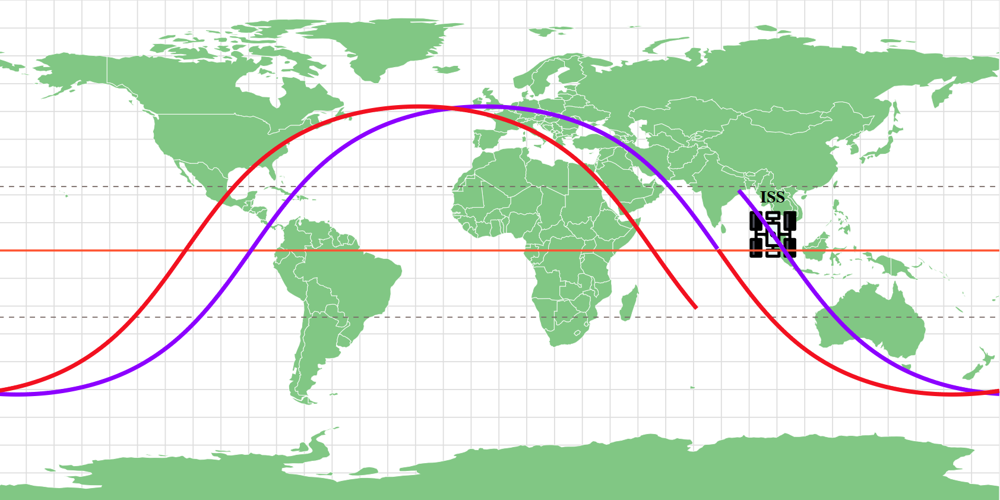

# satTrack :satellite: 

2D Map based Tracking of satellites around earth.

## Getting Started

1. git clone https://github.com/the-redlord/satTrack.git
2. npm install
4. npm start

### Prerequisites

* NodeJS
* npm

## Deployment

Deployed to GitHub Pages : https://the-redlord.github.io/satTrack/

## Built With

* NodeJS
* ReactJS

## Authors

* **Chinmay Sharma**

## License

This project is licensed under the MIT License.

## Available Scripts

In the project directory, you can run:

### `npm start`

Runs the app in the development mode. 
Open [http://localhost:3000](http://localhost:3000) to view it in the browser.

The page will reload if you make edits. 
You will also see any lint errors in the console.

### `npm run build`

Builds the app for production to the `build` folder. 
It correctly bundles React in production mode and optimizes the build for the best performance.

The build is minified and the filenames include the hashes. 
Your app is ready to be deployed!

See the section about [deployment](https://facebook.github.io/create-react-app/docs/deployment) for more information.
